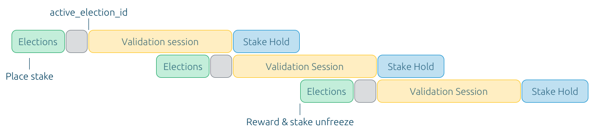

# FAQ

## Популярные вопросы

_Выберем топ-10 по итогам заполнения._

## Блокчейн

### Что такое TON?

С момента запуска Telegram, мессенджер существовал на личные средства Павла Дурова, наконец в 2017 стало известно, что Telegram готовит к запуску собственную блокчейн платформу – Telegram Open Network. 

По плану, платформа должна была стать решением для борьбы с государственной цензурой, включая в себя децентрализованные VPN сервисы с возможностью создавать сайты, хранить файлы, совершать платежи и запускать приложения работающие на базе блокчейна. 

Планам не суждено было сбыться и уже в мае 2020 года по условиям мирового соглашения с регулятором в США, Telegram [выходит](https://t.me/durov/116) из разработки блокчейн платформы, передавая проект сообществу, весь исходный код и документация к тому моменту уже были выложены в открытый доступ.

Спустя год, тестовая сеть запущенная Telegram преобразовалась в основную, которая сегодня называется **The Open Network \(TON\)** и представляет из себя экосистему, которая объединит в себе блокчейны, приложения и сервисы, чтобы создать новый интернет: децентрализованный, открытый и свободный от внешней цензуры.

### Чем TON отличается от других блокчейнов?

Одна из ключевых особенностей TON — смарт-контракты, которые могут исполняться параллельно благодаря мультипотоковости. Если представить блокчейн, как магазин, то сети прошлого поколения — это небольшие торговые точки с одной кассой. Чем больше покупателей, тем длиннее очередь и время обслуживания. Блокчейн нового поколения подстраивается под нагрузку, открывая новые кассы при увеличении количества посетителей. Именно на такой архитектуре построен TON. 

... 

### Кто занимается разработкой TON?

...

### Как TON связан с Telegram сейчас?

...

### Сколько всего выпущено монет TON Coin?

...

Также в сети TON предусмотрена инфляция, составляющая 0,6% в год. Это новые монеты выпускаемые блокчейном в пользу валидаторов \(?\) за поддержание работоспособности системы.  

### Как распределены TON Coin?

...

### Кто такие TON Foundation?

...

### Какие существуют комиссии?

...

### Что делать если потерял 24 секретных слова?

...

### Что такое мост?

Мост \(Bridge\) — это звено между двумя блокчейнами, его задача состоит в перемещении токенов из одной сети в другую. Когда токен покидает один блокчейн, то он сжигается или блокируется, а в другом блокчейне создаётся его эквивалент. Поэтому 1 TON в сети Ethereum всегда равен 1 TON в сети The Open Network. 

Контроль выпуска и сжигания монет между блокчейнами осуществляется оракулами – отобранными с помощью голосования участниками сети с хорошей репутацией.

### Кто такой оракул и как им стать?

Мост работает как миниатюрный децентрализованный блокчейн. В сети TON валидаторы выбирают оракулов, которые будут поддерживать работу моста. Для этого каждый оракул кладёт стейк \(или залог\) в 100 000 TON в качестве гарантии честности. Если оракул будет жульничать, он лишится своего залога.

### Как подключиться к тестовой сети?

...

### Как получить тестовые монеты?

... 

## Кошельки и адреса

### Как создать кошелёк?

...

### Как купить TON?

...

### Как можно использовать TON Coin?

1. Валидаторы могут верифицировать транзакции и создавать новые блоки и токены, подкрепляя свою честность с помощью внесённого стейка в TON Coins.
2. Номинаторы могут передавать валидаторам свои монеты во временное пользование, получая часть от вознаграждений за обработку транзакций.
3. Доход, выплачиваемый узлам валидатора в качестве вознаграждения за обработку транзакций и смарт-контрактов в соответствии с консенсусом PoS.
4. Владение TON Coins обеспечивает право голоса для поддержки или противодействия изменениям параметров блокчейна.
5. Оплата услуг и опций, реализованных в TON Services, TON Storage, TON DNS, TON Proxy и TON Web. В частности, для обхода цензуры, хранения данных, сокрытия личности, использования доменных имен на основе блокчейна.

### Почему я вижу разные адреса в кошельках?

... 

### Какие ещё бывают форматы адресов?

...

### Что такое bouncable и non-bouncable адрес?

... 

## Валидаторы и майнинг

### Кто такой валидатор и как им стать?

...

Подробную статистику по текущим валидаторам сети вы найдёте на [этой странице](https://tonmon.xyz/).

### Как проходят выборы?

Процесс валидирования в сети TON разбит на раунды, которые длятся по 18 часов, всё начинается с выборов ...

### Сколько зарабатывают валидаторы?

Награда зависит в том числе от загрузки сети, приблизительно вознаграждение составляет 0,065 – 0,075% за раунд валидации \(65536 секунд\), то есть валидатор со стейком 100 000 TON Coin заработает от 65 до 75 монет за каждый раунд.

### Кто такой номинатор и как им стать?

...

### Как работает майнинг в TON?

После постановления суда, запрещающего запуск криптовалюты Gram, команда Telegram вышла из разработки, переведя большую часть своих монет \(98,55% от общего количества\) в смарт-контракты Proof-of-Work Giver. Добыча монет из них возможна только путем вызова этих смарт-контрактов и решения криптографических задач с использованием значительной вычислительной мощности.

Подробную статистику майнинга вы можете найти [на этом сайте](https://tonmine.xyz/). 

### Что такое гиверы?

Proof-of-Work Givers – специальные смарт-контракты, на которых изначально находились 5 млрд монет, из которых майнеры получают вознаграждение за свою работу.

Выражаясь простым языком, PoW Giver это смарт-контракт, который предоставляет вычислительную головоломку. Решение этой задачи вознаграждается фиксированным количеством монет. Затем возникает новая задача. Единственный способ решения этой головоломки - последовательный, стремительный перебор чисел, требующий серьезных вычислительных ресурсов. Если задача решается слишком быстро, контракт PoW Giver увеличивает уровень сложности, что означает, что для её решения требуется больше мощностей. Тем не менее, если решение заняло слишком много времени, уровень сложности снижается. Таким образом, PoW Giver контракт поддерживает стабильное количество монет, выдаваемых в день. Чем больше пользователей участвует в процессе, тем сложнее задача. Вам требуется найти решение, и сделать это быстрее, чем другие участники.

На практике пользователи запускают специальное программное обеспечение, которое перебирает числа и отправляет предлагаемые решения в контракты PoW Givers. Чем выше производительность компьютера майнера, на котором работает это программное обеспечение, тем выше вероятность получения монет. Чем больше майнеров в сети, тем выше вычислительная сложность майнинга и тем больше вычислительной мощности требуется для добычи монет.

### В чём разница между майнингом и валидированием?

Майнинг на алгоритме PoW доступен до тех пор, пока на специальных гиверах есть монеты. Когда они будут добыты, в сети останется только один способ добычи монет, с помощью алгоритма PoS и валидаторов, получающих комиссию за подтверждение транзакций в сети.

### \*\*\*\*

